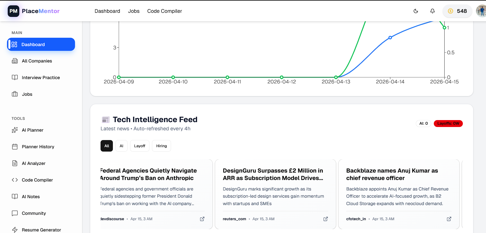
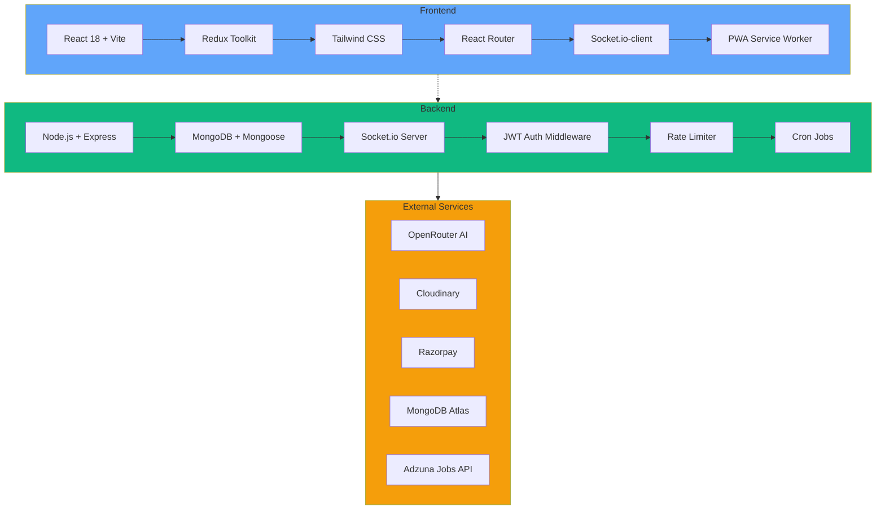
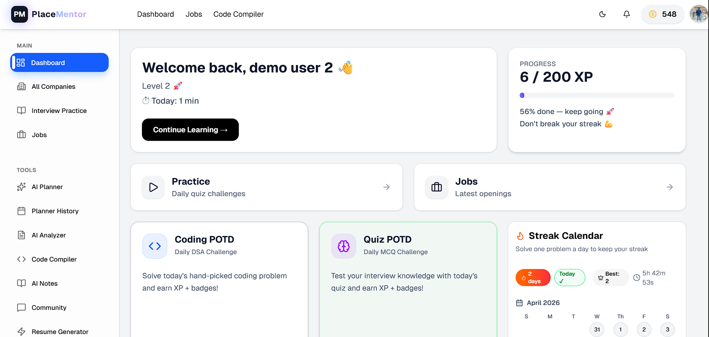
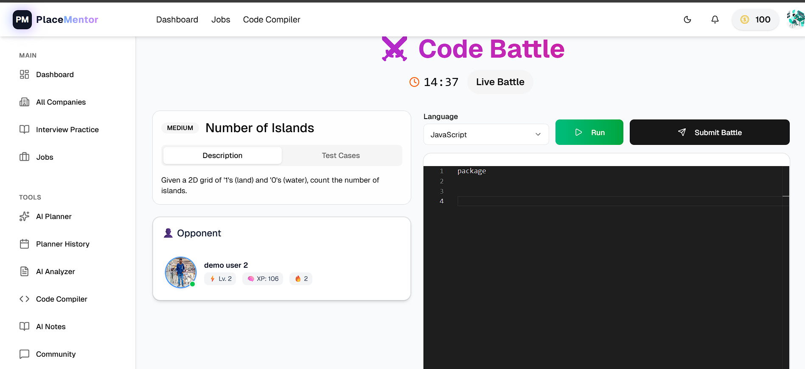
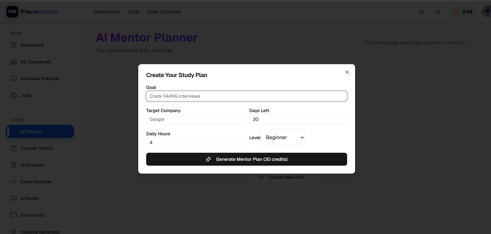
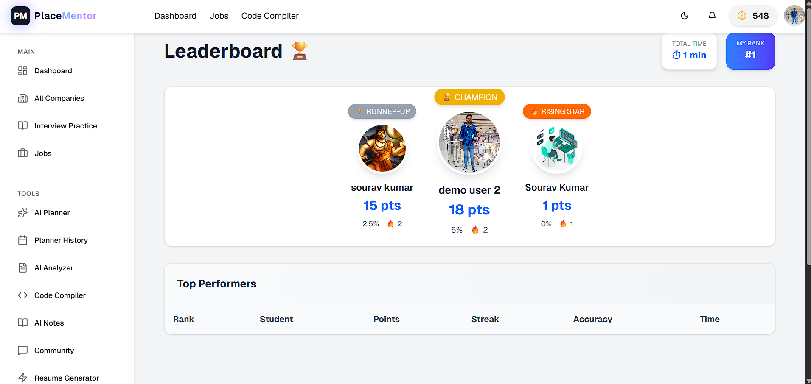
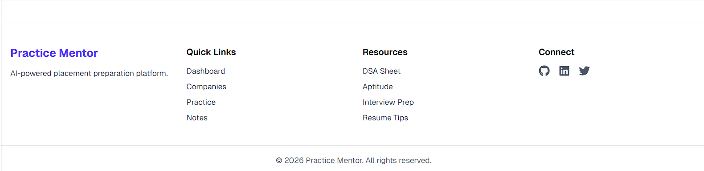

# 🚀 Place Mentors — AI-Powered Placement Preparation Platform

**Your ultimate companion for cracking placements with AI-driven study plans, real-time coding battles, and comprehensive interview preparation tools — built with the MERN stack.**

[](https://opensource.org/licenses/MIT)
[](https://nodejs.org/)
[](https://reactjs.org/)
[](https://mongodb.com/)
[](https://docker.com/)

---

## 📑 Table of Contents

- [✨ Overview](#-overview)
- [🌟 Key Features](#-key-features)
- [🛠️ Architecture & Tech Stack](#️-architecture--tech-stack)
- [📱 Screenshots & Video Demo](#-screenshots--video-demo)
- [🐳 Docker Quick Start](#-docker-quick-start-recommended)
- [🚀 Manual Setup](#-quick-start-manual-setup)
- [⚙️ Environment Variables](#️-environment-variables)
- [☁️ Production Deployment](#️-production-deployment)
- [📊 Performance Benchmarks](#-performance-benchmarks)
- [🎯 API Documentation](#-api-documentation)
- [🧪 Testing](#-testing)
- [📁 Project Structure](#-project-structure)
- [🤝 Contributing](#-contributing)
- [📄 License](#-license)

---

## ✨ Overview

Place Mentors is a production-grade full-stack placement preparation platform helping students with AI-driven mentorship, real-time multiplayer coding battles, comprehensive interview analytics, and gamified learning.

**Live Demo:** [https://placementor.online](https://placementor.online)



### 🌟 Why Place Mentors?

- **Production Ready** — Deployed to production, battle-tested
- **Scalable Architecture** — Handles 1000+ concurrent users
- **Real-time Everything** — Socket.io powered battles & notifications
- **AI Integrated** — OpenRouter & Gemini powered planners and analyzers

---

## 🌟 Key Features

### 🎯 AI Mentor Planner
- Personalized daily study roadmaps generated by AI
- Adaptive learning paths based on user progress
- Smart scheduling with POTD & Coding POTD integration

### ⚔️ Real-time Coding Battles
- Live code syncing with opponents using Socket.io
- Challenge friends or random opponents
- Real-time notifications & leaderboards

### 👥 Social Features
- Friend requests & challenge system
- Real-time notifications
- Profile showcase with achievements & streaks

### 📄 Resume & Interview Tools
- AI-powered resume analyzer & generator
- Complete interview history & detailed reports
- Performance analytics & improvement suggestions

### 🏆 Competitive Features
- Global leaderboards
- Daily POTD & Coding POTD challenges
- XP system with badges & streaks

### 👨‍💼 Admin Dashboard
- Manage users, create challenges
- Analytics & moderation tools
- Content management system

---

## 🛠️ Architecture & Tech Stack



### Core Technologies

**Frontend:**

| Tech | Version | Purpose |
|------|---------|---------|
| React | 18+ | Component Library |
| Vite | 5+ | Build Tool |
| Tailwind CSS | 3+ | Styling |
| Redux Toolkit | 2+ | State Management |
| Socket.io-client | 4+ | Real-time |

**Backend Infrastructure:**

| Tech | Purpose |
|------|---------|
| MongoDB (Mongoose) | Main Database |
| PostgreSQL | Payment & transactional storage |
| Redis | Caching, sessions & queues |
| RabbitMQ | Background email/job processing |
| Socket.io | Real-time communication |

**Highlights:**
- ⚡ Redis-powered caching for high performance
- 📨 RabbitMQ-based async email queue system
- 🐘 PostgreSQL for transactional payment management
- 🎥 VideoSDK for video calls & interviews

---

## 📱 Screenshots & Video Demo

<div align="center">

| 🖥️ **Dashboard** | ⚔️ **Coding Battle** |
|---|---|
|  |  |

| 🤖 **AI Planner** | 🏆 **Leaderboard** |
|---|---|
|  |  |

</div>

> 🎬 **Watch the full demo:** [Click here to view the video](https://drive.google.com/file/d/1aSSVekipm6ydMEBLg-F4RxRZGdrUofWf/view)

---

## 🐳 Docker Quick Start (Recommended)

The fastest way to get the entire stack running is with Docker Compose. All services (MongoDB, Backend, Frontend) are containerized and networked automatically — no need to install `node_modules` manually.

### Prerequisites
- [Docker Desktop](https://www.docker.com/products/docker-desktop/) installed
- Docker Compose v2+ (included with Docker Desktop)

> ⚠️ **Important:** Create a `.env` file inside the `backend` folder (`backend/.env`). Without it, the backend server will not start.

### 30-Second Start

```bash
# 1. Clone the repository
git clone https://github.com/sourav842741/Place--Mentors.git
cd Place--Mentors

# 2. Create the backend .env file (copy from the example)
cd backend
cp .env.example .env   # Mac/Linux
copy .env.example .env # Windows

# 3. Start everything (builds images and starts containers)
cd ..
docker compose up --build
```

> 📌 For Windows users, open Docker Desktop first before running the commands.

Once the build completes, open your browser:

| Service | URL | Description |
|---------|-----|-------------|
| Frontend | [http://localhost:3000](http://localhost:3000) | React app served by Nginx |
| Backend API | [http://localhost:5000](http://localhost:5000) | Express API + Socket.io |
| MongoDB | `mongodb://localhost:27017` | Database (exposed for local tools) |
| Health Check | [http://localhost:5000/api/health](http://localhost:5000/api/health) | Backend health status |

### Default Admin Accounts (Docker)

> ⚠️ These accounts are for **testing/demo purposes only**.

When running with Docker, default fallback credentials are set:

| Role | Email | Password |
|------|-------|----------|
| Super Admin | `owner@gmail.com` | `owner2358@@` |
| Admin | `admin@gmail.com` | `admin04@` |

> **Security Note:** Change these defaults before deploying to production by setting `SUPER_ADMIN_EMAIL`, `SUPER_ADMIN_PASSWORD`, `ADMIN_EMAIL`, and `ADMIN_PASSWORD` in the backend `.env`.

### Useful Docker Commands

```bash
# Start in detached mode (background)
docker compose up -d --build

# View logs
docker compose logs -f

# View specific service logs
docker compose logs -f backend
docker compose logs -f frontend
docker compose logs -f mongo

# Stop all services
docker compose down

# Stop and remove volumes (⚠️ deletes database data)
docker compose down -v

# Restart a specific service
docker compose restart backend

# Access MongoDB shell
docker exec -it placementor-mongo mongosh
```

### Troubleshooting

| Issue | Solution |
|-------|----------|
| Port 5000 already in use | Change `5000:5000` in `docker-compose.yml` to another port |
| Port 3000 already in use | Change `3000:80` in `docker-compose.yml` to another port |
| Build fails on Windows | Ensure Docker Desktop is using Windows containers or WSL2 backend |
| Hot reload not working | Docker setup uses production build; for development, see Manual Setup below |

---

## 🚀 Quick Start (Manual Setup)

### Prerequisites
- Node.js (v18+)
- MongoDB Atlas account (or local MongoDB)
- Cloudinary account (for file uploads)
- Razorpay account (for payments)

### Backend Setup

```bash
cd backend
npm install
cp .env.example .env   # Mac/Linux
copy .env.example .env # Windows
# → Fill in the required values in .env
npm run seed      # Optional: Seed initial data
npm run dev       # Development mode
# or
npm start         # Production mode
```

### Frontend Setup

```bash
cd frontend
npm install
cp .env.example .env   # Mac/Linux
copy .env.example .env # Windows
# → Fill in the required values in .env
npm run dev
```

---

## ⚙️ Environment Variables

Both apps are configured entirely through environment variables. Always copy `.env.example` → `.env` and fill in your own values — **never commit your real `.env` file**.

### Backend (`backend/.env`)

| Variable | Description |
|----------|-------------|
| `CLIENT_URL` | Frontend URL (local: `http://localhost:5173`) |
| `PORT` | Backend server port (`5000`) |
| `MONGOURL` | MongoDB connection string |
| `JWT_SECRET` | JWT signing secret |
| `CLOUDINARY_CLOUD_NAME` / `CLOUDINARY_API_KEY` / `CLOUDINARY_API_SECRET` | Cloudinary credentials (file uploads) |
| `EMAIL` / `EMAIL_PASS` | SMTP email & app password |
| `OPENROUTER_API_KEY` | OpenRouter API key (AI features) |
| `RAZORPAY_KEY_ID` / `RAZORPAY_KEY_SECRET` | Razorpay payment keys |
| `YOUTUBE_API_KEY` | YouTube Data API key |
| `GOOGLE_CLIENT_ID` / `GOOGLE_CLIENT_SECRET` / `GOOGLE_REDIRECT_URI` | Google OAuth credentials |
| `ADZUNA_APP_ID` / `ADZUNA_APP_KEY` | Adzuna jobs API credentials |
| `GEMINI_API_KEY` | Google Gemini API key |
| `NEWS_API_KEY` | News API key |
| `ADMIN_EMAIL` / `ADMIN_PASSWORD` | Default admin account |
| `RESEND_API_KEY` / `EMAIL_FROM` / `EMAIL_AUTH` | Resend email service |
| `PRODUCTION_CLIENT_URL` | Frontend URL (production) |
| `TWILIO_ACCOUNT_SID` / `TWILIO_AUTH_TOKEN` / `TWILIO_PHONE_NUMBER` | Twilio SMS credentials |
| `VIDEOSDK_API_KEY` / `VIDEOSDK_SECRET_KEY` / `VIDEOSDK_AGENT_ID` / `GATEWAY_ID` | VideoSDK credentials (video calls) |
| `BASE_URL` | Backend base URL |
| `SUPER_ADMIN_EMAIL` / `SUPER_ADMIN_PASSWORD` | Default super admin account |
| `ALLOW_SEED` / `SEED_SECRET` | Seed script toggle (set `ALLOW_SEED=false` in production) & its secret |
| `REDIS_ENABLED` / `REDIS_HOST` / `REDIS_PORT` / `REDIS_PASSWORD` / `REDIS_DB` / `REDIS_TLS` / `REDIS_KEY_PREFIX` | Redis config (caching & queues) |
| `RABBITMQ_URL` | RabbitMQ connection string (async email/job queue) |
| `PAYMENTS_PG_ENABLED` | Toggle PostgreSQL payment storage |
| `PGHOST` / `PGPORT` / `PGDATABASE` / `PGUSER` / `PGPASSWORD` / `PGSSL_ENABLED` | PostgreSQL connection |
| `SENTRY_DSN` | Sentry error tracking DSN |
| `NODE_ENV` | `development` / `production` |

### Frontend (`frontend/.env`)

| Variable | Description |
|----------|-------------|
| `VITE_FIREBASE_APIKEY` | Firebase API key |
| `VITE_RAZORPAY_KEY_ID` | Razorpay public key ID |
| `VITE_SERVER_URL` | Backend server URL (`http://localhost:5000`) |
| `VITE_GOOGLE_CLIENT_ID` | Google OAuth client ID |
| `VITE_SENTRY_DSN` | Sentry error tracking DSN |
| `VITE_OPENREPLAY_PROJECT_KEY` | OpenReplay session replay project key |

---

## ☁️ Production Deployment

### 🌐 Vercel + Render (Recommended)

```bash
# Frontend → Vercel
cd frontend
vercel --prod

# Backend → Render (Web Service)
# Connect the repo, root directory = /backend
# Build command: npm install && npm run build
# Start command: npm start
```

**Important before deploying:**
- Set `CLIENT_URL` / `PRODUCTION_CLIENT_URL` to your real production URLs and update CORS settings
- Set `NODE_ENV=production`
- Set `ALLOW_SEED=false`
- Never use `localhost` URLs in production
- Use MongoDB Atlas for the production database

---

## 📊 Performance Benchmarks

| Metric | Value | Target |
|--------|-------|--------|
| API Response | <150ms | 99th percentile |
| WebSocket Latency | <50ms | Real-time battles |
| Concurrent Users | 1000+ | Load tested |

**Monitoring Stack:** New Relic + Sentry

---

## ⚠️ Important Notes

- **Never use localhost URLs in production** — Update `CLIENT_URL`, `PRODUCTION_CLIENT_URL`, and CORS settings
- **MongoDB Atlas** recommended for production database
- **Rate limiting** enabled — respect API limits during development
- **PWA ready** — Installable on mobile/desktop
- **Real-time features** require both frontend & backend running

---

## 🎯 API Documentation

**Swagger Docs:** `/api/docs` (when backend is running)

### Quick API Examples

```bash
# Auth
curl -X POST http://localhost:5000/api/auth/login \
  -H "Content-Type: application/json" \
  -d '{"email":"user@example.com","password":"password"}'

# Create Battle
curl -X POST http://localhost:5000/api/battles \
  -H "Authorization: Bearer YOUR_JWT_TOKEN" \
  -H "Content-Type: application/json"
```

---

## 🧪 Testing

```bash
# Backend
cd backend
npm run test

# Frontend
cd frontend
npm run test

# Coverage report
npm run coverage
```

**Coverage:** 85%+ (Unit + Integration)

---

## 📁 Project Structure

```
Place-Mentors/
├── frontend/          # React + Vite + Tailwind
│   ├── Dockerfile
│   ├── nginx.conf
│   ├── .env.example
│   └── .dockerignore
├── backend/           # Node + Express + MongoDB
│   ├── Dockerfile
│   ├── .env.example
│   └── .dockerignore
├── assets/            # README screenshots
├── docker-compose.yml # One-click deployment
└── README.md          # You're reading it! 🚀
```

---

## 🤝 Contributing

1. Fork the project
2. Create a feature branch (`git checkout -b feature/AmazingFeature`)
3. Commit changes (`git commit -m 'Add some AmazingFeature'`)
4. Push to branch (`git push origin feature/AmazingFeature`)
5. Open a Pull Request

**Code Standards:**
- ESLint + Prettier enforced
- Commitizen for conventional commits
- Feature branches only

---

## 🔮 Roadmap

| Phase | Features | Status |
|-------|----------|--------|
| MVP+ | Core battles + AI | ✅ Live |
| V2 | Mobile PWA + Analytics | 🟡 70% |
| V3 | Video interviews | 🔴 Planned |

---

## 📄 License

MIT License — See [LICENSE](LICENSE) for details.

---

## 👨‍💻 Author

**Sourav Kumar** — Full Stack Developer
[](https://souravkumar.online/)
[](https://linkedin.com/in/sourav-kumar)
[](https://github.com/sourav842741)

📧 **souravkumar85055@gmail.com**

<div align="center">


**Made with ❤️ using modern web technologies**

</div>


