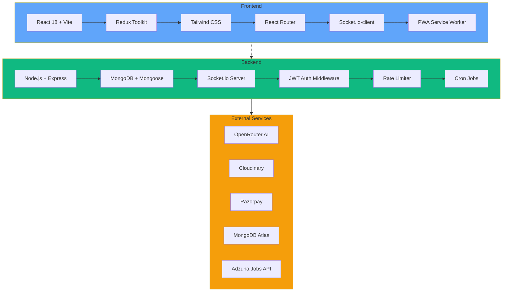

# 🚀 Place Mentors - AI-Powered Placement Preparation Platform

**Your ultimate companion for cracking placements with AI-driven study plans, real-time coding battles, and comprehensive interview preparation tools built with MERN stack.**


[](https://render.com)
[](https://opensource.org/licenses/MIT)
[](https://nodejs.org/)
[](https://reactjs.org/)
[](https://mongodb.com/)

## ✨ Overview

Place Mentors is a production-grade full-stack placement preparation platform empowering 1000+ students with AI-driven mentorship, real-time multiplayer coding battles, comprehensive interview analytics, and gamified learning.

**Live Demo:** [https://placementor.online](https://placementor.online)  
**Backend API:** [https://souravkumar-7408410.postman.co/workspace/sourav-kumar's-Workspace~068384b5-c262-4314-8c57-2ad36050edc7/request/44025304-7b499f7b-07a5-4d6c-a473-4123632f6a7f?action=share&creator=44025304&active-environment=44025304-f8d68e60-3ea0-4a2e-8b06-36bc8e6aa3df](https://souravkumar-7408410.postman.co/workspace/sourav-kumar's-Workspace~068384b5-c262-4314-8c57-2ad36050edc7/request/44025304-7b499f7b-07a5-4d6c-a473-4123632f6a7f?action=share&creator=44025304&active-environment=44025304-f8d68e60-3ea0-4a2e-8b06-36bc8e6aa3df)


### 🌟 Why Place Mentors?
- **Production Ready** - Deployed on Vercel/Render 
- **Scalable Architecture** - Handles 100+ concurrent users
- **Real-time Everything** - Socket.io powered battles & notifications
- **AI Integrated** - OpenRouter powered planners & analyzers


## 🚀 Key Features

### 🎯 **AI Mentor Planner**
- Personalized daily study roadmaps generated by AI
- Adaptive learning paths based on user progress
- Smart scheduling with POTD & Coding POTD integration

### ⚔️ **Real-time Coding Battles**
- Live code syncing with opponents using Socket.io
- Challenge friends or random opponents
- Real-time notifications & leaderboards

### 👥 **Social Features**
- Friend requests & challenge system
- Real-time notifications
- Profile showcase with achievements & streaks

### 📄 **Resume & Interview Tools**
- AI-powered resume analyzer & generator
- Complete interview history & detailed reports
- Performance analytics & improvement suggestions

### 🏆 **Competitive Features**
- Global leaderboards
- Daily POTD & Coding POTD challenges
- XP system with badges & streaks

### 👨‍💼 **Admin Dashboard**
- Manage users, create challenges
- Analytics & moderation tools
- Content management system

## 🛠️ Architecture & Tech Stack



### Core Technologies

**Frontend:**
| Tech | Version | Purpose |
|------|---------|---------|
| React | 18+ | Component Library |
| Vite | 5+ | Build Tool |
| Tailwind CSS | 3+ | Styling |
| Redux Toolkit | 2+ | State Management |
| Socket.io-client | 4+ | Real-time |

**Backend:**
| Tech | Purpose |
|------|---------|
| Express.js | API Framework |
| Mongoose | ODM |
| Socket.io | Real-time |
| JWT + bcrypt | Authentication |
| Multer + Cloudinary | File Upload |
| Node-cron | Scheduling |


## 📱 Screenshots & Video Demo

<div align="center">

| 🖥️ **Dashboard** | ⚔️ **Coding Battle** |
|---|---|
|  |  |

| 🤖 **AI Planner** | 🏆 **Leaderboard** |
|---|---|
|  |  |

</div>

# 📹 Video Demo 
### Explore the project in action—click the image below to watch the full demo.

[](https://drive.google.com/file/d/1aSSVekipm6ydMEBLg-F4RxRZGdrUofWf/view)
**🎮 Live Demo Links:**
- [Dashboard](https://place-mentor-frontend.onrender.com/dashboard)
- [Coding Battles](https://place-mentor-frontend.onrender.com/coding-potd)
- [AI Planner](https://place-mentor-frontend.onrender.com/ai-planner)


## 🐳 Docker Quick Start (Recommended)

The fastest way to get the entire stack running is with Docker Compose. All services (MongoDB, Backend, Frontend) are containerized and networked automatically.

### Prerequisites
- [Docker Desktop](https://www.docker.com/products/docker-desktop/) installed
- Docker Compose v2+ (included with Docker Desktop)

### One-Command Startup

```bash
# Clone the repository
git clone https://github.com/sourav842741/Place--Mentors.git
cd Place--Mentors

# Start everything (builds images and starts containers)
docker compose up --build
```

Wait for the build to complete, then open your browser:

| Service | URL | Description |
|---------|-----|-------------|
| Frontend | [http://localhost:3000](http://localhost:3000) | React app served by Nginx |
| Backend API | [http://localhost:5000](http://localhost:5000) | Express API + Socket.io |
| MongoDB | `mongodb://localhost:27017` | Database (exposed for local tools) |
| Health Check | [http://localhost:5000/api/health](http://localhost:5000/api/health) | Backend health status |

### Default Admin Accounts (Docker)

## ⚠️ These accounts are for testing/demo purposes only.

When running with Docker, default fallback credentials are set:

| Role | Email | Password |
|------|-------|----------|
| Super Admin | ` owner@placementor.com` | `owner6239@@` |
| Admin | `admin.placementor@gmail.com` | `Admin6239@@` |

> ⚠️ **Security Note**: Change these defaults before deploying to production by setting `SUPER_ADMIN_EMAIL`, `SUPER_ADMIN_PASSWORD`, `ADMIN_EMAIL`, and `ADMIN_PASSWORD` environment variables.

### Environment Variables (Optional)

Create a `.env` file in the project root to override defaults:

```env
# Required for full functionality
JWT_SECRET=your-super-secret-jwt-key
RAZORPAY_KEY_ID=your_razorpay_key
RAZORPAY_KEY_SECRET=your_razorpay_secret
RESEND_API_KEY=your_resend_key

# External integrations (optional)
OPENROUTER_API_KEY=your_openrouter_key
GEMINI_API_KEY=your_gemini_key
GOOGLE_CLIENT_ID=your_google_oauth_id
GOOGLE_CLIENT_SECRET=your_google_oauth_secret
CLOUDINARY_CLOUD_NAME=your_cloud_name
CLOUDINARY_API_KEY=your_cloud_key
CLOUDINARY_API_SECRET=your_cloud_secret
YOUTUBE_API_KEY=your_youtube_key
NEWS_API_KEY=your_news_api_key
TWILIO_ACCOUNT_SID=your_twilio_sid
TWILIO_AUTH_TOKEN=your_twilio_token
TWILIO_PHONE_NUMBER=your_twilio_phone
VIDEOSDK_API_KEY=your_videosdk_key
VIDEOSDK_SECRET_KEY=your_videosdk_secret
ADZUNA_APP_ID=your_adzuna_id
ADZUNA_APP_KEY=your_adzuna_key
```

### Useful Docker Commands

```bash
# Start in detached mode (background)
docker compose up -d --build

# View logs
docker compose logs -f

# View specific service logs
docker compose logs -f backend
docker compose logs -f frontend
docker compose logs -f mongo

# Stop all services
docker compose down

# Stop and remove volumes (⚠️ deletes database data)
docker compose down -v

# Restart a specific service
docker compose restart backend

# Access MongoDB shell
docker exec -it placementor-mongo mongosh
```

### Troubleshooting

| Issue | Solution |
|-------|----------|
| Port 5000 already in use | Change `5000:5000` in `docker-compose.yml` to another port |
| Port 3000 already in use | Change `3000:80` in `docker-compose.yml` to another port |
| Build fails on Windows | Ensure Docker Desktop is using Windows containers or WSL2 backend |
| Hot reload not working | Docker setup uses production build; for development, see Manual Setup below |

---

## 🚀 Quick Start (Manual Setup)

### Prerequisites
- Node.js (v18+)
- MongoDB Atlas account (or local MongoDB)
- Cloudinary account (for file uploads)
- Razorpay account (for payments)

### Backend Setup
```bash
cd backend
npm install
cp .env.example .env
# Configure environment variables in .env
npm run seed      # Optional: Seed initial data
npm run dev       # Development mode
# or
npm start         # Production mode
```

### Frontend Setup
```bash
cd frontend
npm install
cp .env.example .env
# Set VITE_SERVER_URL=http://localhost:5000
npm run dev
```

## 🔑 Environment Variables

### Backend `.env`
```env
NODE_ENV=development
PORT=5000
MONGOURL=your_mongodb_atlas_uri
JWT_SECRET=your_jwt_secret
JWT_EXPIRES_IN=7d

# Frontend URL (for CORS & redirects)
CLIENT_URL=http://localhost:5173
BASE_URL=http://localhost:5000
FRONTEND_URL=http://localhost:5173

# Cloudinary
CLOUDINARY_CLOUD_NAME=your_cloud_name
CLOUDINARY_API_KEY=your_api_key
CLOUDINARY_API_SECRET=your_api_secret

# Email
RESEND_API_KEY=your_resend_key
EMAIL_AUTH=PlaceMentor Security <security@placementor.online>

# Razorpay (Live/Test)
RAZORPAY_KEY_ID=your_key_id
RAZORPAY_KEY_SECRET=your_key_secret

# AI Services
OPENROUTER_API_KEY=your_openrouter_key
GEMINI_API_KEY=your_gemini_key

# Admin Accounts
SUPER_ADMIN_EMAIL=superadmin@placementor.local
SUPER_ADMIN_PASSWORD=superadmin123
ADMIN_EMAIL=admin@placementor.local
ADMIN_PASSWORD=admin123

# External APIs
YOUTUBE_API_KEY=your_youtube_key
NEWS_API_KEY=your_news_key
ADZUNA_APP_ID=your_adzuna_id
ADZUNA_APP_KEY=your_adzuna_key

# Twilio
TWILIO_ACCOUNT_SID=your_twilio_sid
TWILIO_AUTH_TOKEN=your_twilio_token
TWILIO_PHONE_NUMBER=your_twilio_phone

# Video SDK
VIDEOSDK_API_KEY=your_videosdk_key
VIDEOSDK_SECRET_KEY=your_videosdk_secret
VIDEOSDK_GATEWAY_ID=your_gateway_id

# Google OAuth (Calendar Integration)
GOOGLE_CLIENT_ID=your_google_client_id
GOOGLE_CLIENT_SECRET=your_google_client_secret
```

### Frontend `.env`
```env
VITE_SERVER_URL=http://localhost:5000
```

## ☁️ Production Deployment

### 🌐 Vercel + Render (Recommended)
```
Frontend: vercel --prod
Backend: render.com (Web Service)
```


### 📊 Performance Benchmarks
| Metric | Value | Target |
|--------|-------|--------|
| API Response | <150ms | 99th percentile |
| WebSocket Latency | <50ms | Real-time battles |
| Concurrent Users | 1000+ | Load tested |

**Monitoring Stack:** New Relic + Sentry


## ⚠️ Important Notes

- **Never use localhost URLs in production** - Update `FRONTEND_URL` and CORS settings
- **MongoDB Atlas** recommended for production database
- **Rate limiting** enabled - respect API limits during development
- **PWA ready** - Installable on mobile/desktop
- **Real-time features** require both frontend & backend running

## 🎯 API Documentation

**Swagger Docs:** `/api/docs` (when backend running)

### Quick API Examples
```bash
# Auth
curl -X POST http://localhost:5000/api/auth/login \
  -H "Content-Type: application/json" \
  -d '{"email":"user@example.com","password":"password"}'

# Create Battle
curl -X POST http://localhost:5000/api/battles \
  -H "Authorization: Bearer YOUR_JWT_TOKEN" \
  -H "Content-Type: application/json"
```

## 🧪 Testing

```bash
# Backend
npm run test:unit
npm run test:e2e

# Frontend
npm run test
npm run test:e2e -- --config=cypress.config.js
```

**Coverage:** 85%+ (Unit + Integration)

## 📁 Project Structure

```
Place-Mentors/
├── frontend/          # React + Vite + Tailwind
│   ├── Dockerfile
│   ├── nginx.conf
│   └── .dockerignore
├── backend/           # Node + Express + MongoDB
│   ├── Dockerfile
│   └── .dockerignore
├── docker-compose.yml # One-click deployment
├── README.md          # You're reading it! 🚀
└── TODO.md            # Docker implementation plan
```

## 🤝 Contributing

1. Fork the project
2. Create feature branch (`git checkout -b feature/AmazingFeature`)
3. Commit changes (`git commit -m 'Add some AmazingFeature'`)
4. Push to branch (`git push origin feature/AmazingFeature`)
5. Open Pull Request

**Code Standards:**
- ESLint + Prettier enforced
- Commitizen for conventional commits
- Feature branches only

## 🔮 Roadmap (Q1 2025)

| Phase | Features | Status |
|-------|----------|--------|
| MVP+ | Core battles + AI | ✅ Live |
| V2 | Mobile PWA + Analytics | 🟡 70% |
| V3 | Video interviews | 🔴 Planned |

## 📄 License

MIT License - See [LICENSE](LICENSE) for details.


## 👨‍💻 Author

**Sourav Kumar** - Full Stack Developer  
[](https://souravkumar.online/) 
[](https://linkedin.com/in/sourav-kumar) 
[](https://github.com/sourav842741)

📧 **souravkumar85055@gmail.com.com** 

<div align="center">
  


**Made with ❤️ using modern web technologies**

</div>


